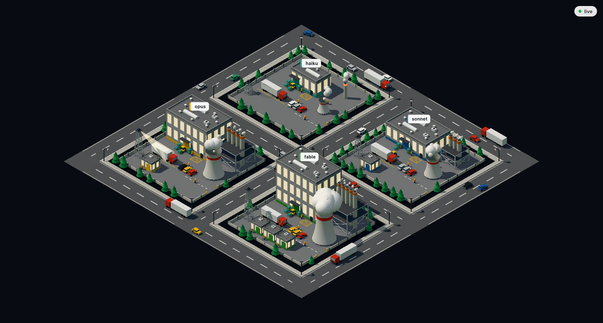

# Agent Factory

Toont elke draaiende Claude Code-sessie als een fabriek in een 3D industrieterrein. Een druk kavel licht op: ramen gloeien, rook en stoom komen op gang, werkers lopen rond en er rijdt verkeer.

Lokaal zie je je eigen sessies. Draait er een centrale op kantoor, dan zie je het park van iedereen die eraan meedoet.



## Draaien

Voor lokaal ontwikkelen:

```
pnpm install
pnpm dev
```

Open daarna http://localhost:5173. Dit start de Node-server op `127.0.0.1:4317` en de Vite-pagina samen. Vite proxyt `/ws` naar de server, en de pagina probeert elke 2 seconden opnieuw te verbinden zolang de server plat ligt.

Voor productie of de centrale: bouw eerst, start daarna één proces dat zowel de pagina als de WebSocket serveert.

```
pnpm build
pnpm start
```

`pnpm start` luistert op poort 4317. Kijken naar het park vraagt dan geen dev-server, alleen een browser naar dat adres.

## Wat je ziet

- één kavel per sessie, met de gebruiker op het bord
- de hal en machines zijn geschaald op het model dat de sessie draait (zie hieronder)
- sessies in hetzelfde project delen een accentkleur
- subagents verschijnen als kleine loodsen op het erf van de ouder, tot 4 per kavel; het aantal rijdende auto's op de weg volgt het aantal subagents
- beweeg over een hal of loods voor de gebruiker, status, project en model (alleen op kavels die volledig getekend zijn, zie hieronder)
- sleep om te draaien, scroll om te zoomen

| Model | Kavel |
| --- | --- |
| Haiku | kleine hal, 1 stapel, kleine koeltoren, korte zoeklichttoren |
| Sonnet, of nog geen bekend model | volledige hal met 1 rij ramen, 3 stapels, koeltoren, vakwerktoren |
| Opus | 2 rijen ramen, 4 hogere stapels, grotere koeltoren, hogere vakwerktoren |
| Fable of Mythos | 3 rijen ramen, 5 hoge stapels, grootste koeltoren, hoogste vakwerktoren |

Het model komt uit het transcript, dus een verse sessie start als een Sonnet-formaat kavel en wordt ter plekke herbouwd zodra het eerste antwoord binnenkomt. Van model wisselen met `/model` herbouwt het kavel op dezelfde manier. Loodsen voor subagents hebben één vaste maat.

Er is nog maar één busy-waarde per kavel, geen aparte staat per tool.

| Status | Animatie |
| --- | --- |
| idle | donkere ramen, machines uit, geen auto op de weg |
| busy | ramen gloeien, rook en stoom komen op gang, werkers lopen, verkeer rijdt |

## Hoe het werkt

De server in `server/` houdt `~/.claude/sessions/` en `~/.claude/projects/` in de gaten. Hij leest elk sessiebestand voor het proces-id en de status, en tailt het transcript om de lopende tool te vinden. Bij het eerste zicht op een transcript leest hij alleen de laatste 64 KB, en daarna alleen nieuwe bytes. Elke wijziging gaat naar de pagina via een WebSocket.

Het bericht dat de lijn overgaat, telt precies zeven velden en niets meer: `id`, `user`, `project`, `model`, `status`, `subagents` (een aantal, geen lijst van namen) en `startedAt`. Samen 121 tot 180 bytes per sessie, afhankelijk van hoe lang het sessie-id en de modelnaam zijn. De reporter leest de toolnaam en het tooldoel nog wel uit het transcript, want daaruit leidt hij `busy` af, maar die velden verlaten de machine niet. Prompts, antwoorden en bestandsinhoud blijven op schijf. De server schrijft nooit onder `~/.claude/`.

Met `HUB` ingesteld draait de server als reporter: één uitgaande verbinding naar de centrale, en verder niets. Geen HTTP-server, geen poort, geen pagina. Een centrale zet wat hij ontvangt naast zijn eigen sessies en laat de sessies van een machine vallen zodra die verbinding sluit. Kijken doe je bij de centrale.

De centrale pingt elke verbonden socket elke 30 seconden en verbreekt een socket die twee pings op rij niet beantwoordt. Een reporter pingt zelf niet, maar let op de pings van de centrale: blijft die 90 seconden stil, dan verbreekt hij de verbinding en maakt hij een nieuwe. Dat opnieuw verbinden begint met 2 seconden en loopt op tot maximaal 30, met wat toeval erin, zodat dertig Macs na een herstart van de centrale niet allemaal in dezelfde seconde terugkomen.

De pagina in `web/` tekent het park met Three.js. Statische onderdelen van een kavel zijn samengevoegd tot één mesh, en herhaalde onderdelen zoals bomen en ramen zijn instanced.

Niet elk kavel wordt volledig getekend. De dichtstbijzijnde 40 kavels krijgen het volle detail, de rest is een terrein met een hal en een gekleurd dakbaken. `?detail=N` in de URL past dat plafond aan. Dat is wat een park van 150 fabrieken op 60 fps mogelijk maakt.

`?stats` in de URL geeft een overlay met draw calls, driehoeken, frametijd (gemiddeld en p95) en het aantal kavels, gedetailleerd versus totaal.

Linksboven staat een filterpaneel: filter op gebruiker, project en status, plus een knop "spring naar mij" die de camera naar het gemiddelde punt van jouw eigen kavels stuurt.

Zonder `--hub` luistert de server alleen op localhost. Een hub luistert op elke netwerkinterface, dus iedereen op hetzelfde netwerk kan verbinden en dezelfde stream lezen. Draai een hub alleen op een netwerk dat je vertrouwt.

Claude Code bepaalt het formaat van deze bestanden, dus een update kan de lezer breken.

## Meekijken op de centrale

Draait het park op de vaste centrale machine, dan hoef je niets te installeren om mee te kijken. Open in de browser `http://agentfactory.local:4317` en je ziet het park van iedereen.

`/healthz` op die centrale antwoordt altijd 200 zolang het proces draait, met in de body het aantal verbonden reporters (`reporters`) en hoe lang de laatste sessiewijziging geleden is (`lastUpdateAgeMs`). Wat daarvan alarm waard is, beslist wie de check aanroept: een stil park en een vastgelopen park zien er in `lastUpdateAgeMs` hetzelfde uit. `/metrics` geeft het aantal verbonden machines, berichten per seconde, en per machine de protocolversie en het laatste bericht.

## Meedoen op je eigen Mac

Kloon deze repo, haal de dependencies op en draai het installatiescript:

```
pnpm install
scripts/install.sh
```

Het script vraagt om een machinenaam, het adres van de centrale (bijvoorbeeld `ws://agentfactory.local:4317`) en een token als de centrale er een vraagt. Daarna zet het een launchd-agent klaar die je sessies naar de centrale stuurt, ook na een herstart van je Mac. Draai je het script een tweede keer, dan vervangt het de bestaande agent in plaats van er een tweede naast te zetten.

Deze modus is een reporter: hij opent alleen een verbinding naar buiten, hij start zelf geen pagina en claimt geen poort.

Stoppen is ook één commando, het script print hem aan het eind:

```
launchctl unload -w ~/Library/LaunchAgents/com.agentfactory.reporter.plist
```

Zie [`deploy/pi.md`](deploy/pi.md) voor het opzetten van de centrale zelf, op een Raspberry Pi.

## Een park op schaal bekijken

`pnpm fake-park` zet nepmachines op tegen een centrale, zodat je een park op schaal kunt bekijken zonder dertig echte Macs erbij te slepen.

```
SPOKES=30 SESSIONS_PER_SPOKE=5 HUB=ws://127.0.0.1:4317 pnpm fake-park
```

Env-variabelen: `SPOKES` (aantal nepmachines, standaard 10), `SESSIONS_PER_SPOKE` (sessies per machine, standaard 5), `HUB` (adres van de centrale) en `SEED` (voor een reproduceerbare run).

Met `FREEZE=1` bouwt het park zich op en staat daarna stil: geen sessies die komen of gaan, geen statussen die omslaan. Handig als je iets in beeld wilt vergelijken over twee momenten, want normaal wisselt elke machine om de één tot drie seconden iets en groeit hij door tot het dubbele van `SESSIONS_PER_SPOKE`.

```
FREEZE=1 SEED=park SPOKES=30 SESSIONS_PER_SPOKE=5 HUB=ws://127.0.0.1:4317 pnpm fake-park
```

## Ontwikkelen

```
pnpm test
pnpm typecheck
```

Specs en change proposals staan in `openspec/`.
