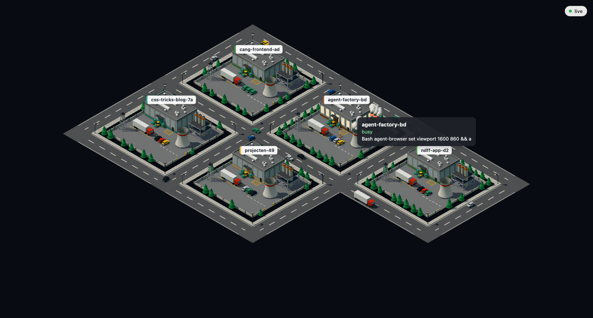

# Agent Factory

Shows every running Claude Code session on your machine as a factory in a 3D industrial park. A busy agent lights up its lot, and each tool type drives a different machine.



## Run it

```
pnpm install
pnpm dev
```

Then open http://localhost:5173. This starts the Node server on `127.0.0.1:4317` and the Vite page together. Vite proxies `/ws` to the server, and the page reconnects every 2 seconds while the server is down.

## What you see

- one lot per session, with the session name on the sign
- sessions in the same folder share an accent color
- subagents show up as small warehouses inside the parent yard, up to 4 per lot
- hover a hall or warehouse for the name, status and current tool
- drag to rotate, scroll to zoom

| Agent state | Animation |
| --- | --- |
| idle | dark windows, machines off, no truck on the road |
| busy, no tool running | windows glow, thin smoke, slow steam, a truck drives around the lot |
| editing or writing files | forklift carries pallets between the dock and the truck |
| running a shell command | chimney rims glow orange and smoke is fast and thick |
| reading or searching files | searchlight sweeps the yard |
| any other tool | cooling tower steam is fast and thick |

## How it works

The server in `server/` watches `~/.claude/sessions/` and `~/.claude/projects/`. It reads each session file for the process id and status, and tails the transcript to find the running tool. On first sight it reads only the last 64 KB of a transcript, and only new bytes after that. Each change goes to the page over a WebSocket.

The page in `web/` draws the park with Three.js. Static parts of a lot are merged into one mesh, and repeated parts like trees and windows are instanced.

Only the tool name and a short label leave the server. The label is a file name, or the first 40 characters of a command or search pattern. Prompts, responses and file contents stay on disk. The server listens on localhost only and never writes under `~/.claude/`.

Claude Code owns the format of these files, so an update can break the reader.

## Develop

```
pnpm test
pnpm typecheck
```

Specs and change proposals live in `openspec/`.
