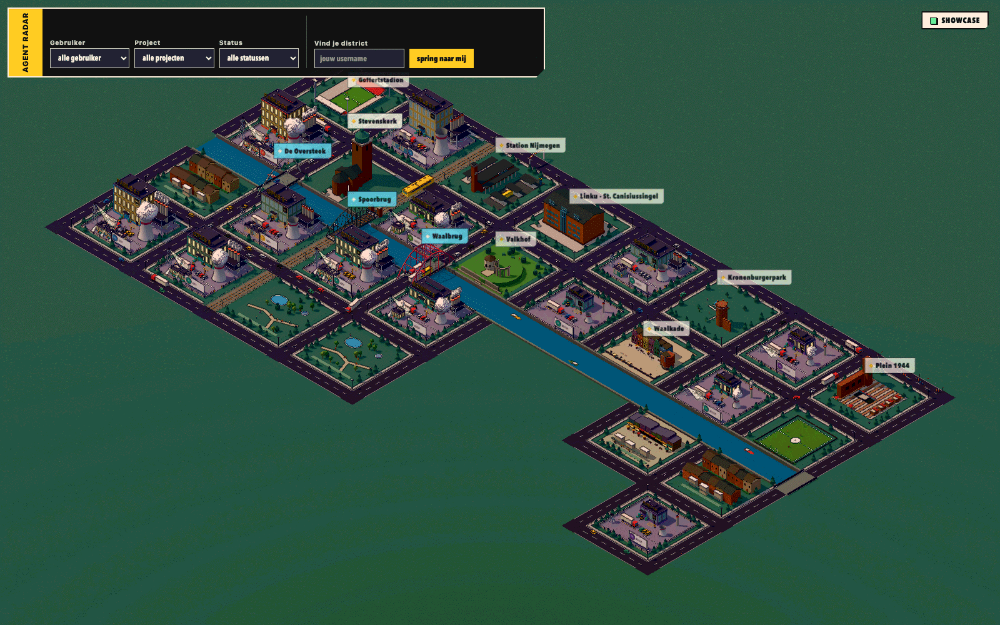
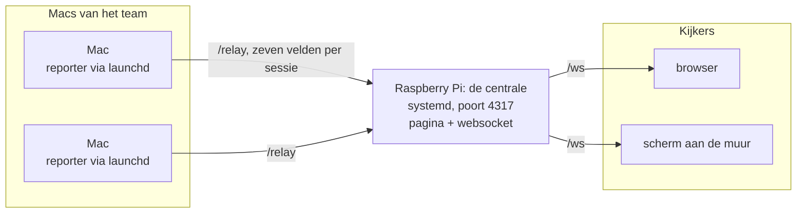
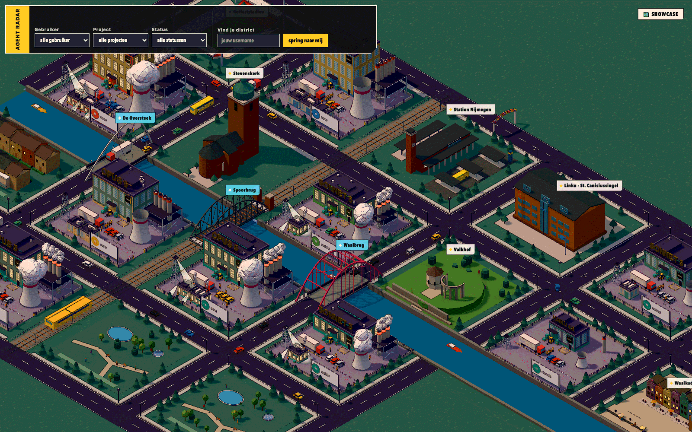
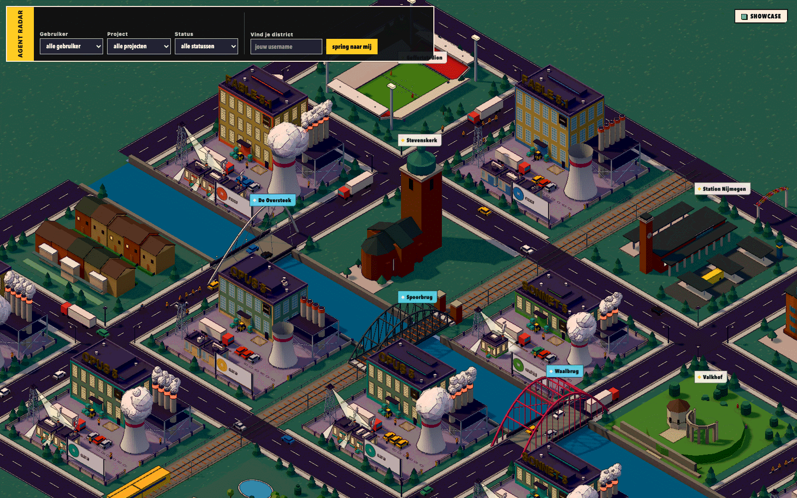
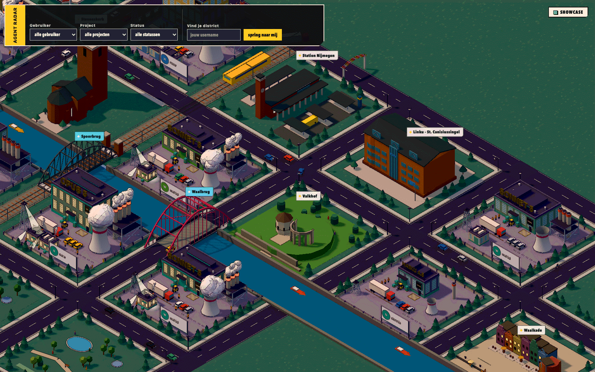

# Agent Factory



Elke Claude Code-sessie op kantoor wordt een fabriek in een 3D-versie van Nijmegen, en wie druk bezig is, laat zijn schoorstenen roken.



Elke Mac draait een kleine reporter die de eigen sessies leest en doorstuurt. De Pi voegt alles samen en serveert de pagina. Wie kijkt, heeft alleen een browser nodig.

## Wat moet ik doen?

| Je wilt | Wat je doet |
| --- | --- |
| **Meekijken** | Open http://agentfactory.local:4317 op het kantoornetwerk. Installeren hoeft niet. |
| **Meedoen met je Mac** | Kloon de repo, `pnpm install`, `scripts/install.sh`. Zie [Meedoen met je Mac](#meedoen-met-je-mac). |
| **De centrale beheren** | Volg [`deploy/pi.md`](deploy/pi.md): installatie, token, bijwerken, logs en storingen op de Pi. |

## Meedoen met je Mac

Je hebt Node 24 en pnpm nodig, en je Mac moet op hetzelfde netwerk zitten als de Pi (niet op het gastennetwerk).

```
git clone <repo-url> ~/agent-factory
cd ~/agent-factory
pnpm install
scripts/install.sh
```

Het script stelt vier vragen:

| Vraag | Wat je invult |
| --- | --- |
| `Machinenaam (leeg = hostname)` | De naam waaronder je Mac in `/metrics` staat. Leeg laten geeft de korte hostnaam. |
| `Centrale, bijvoorbeeld ws://agentfactory.local:4317` | Het adres van de Pi. Het moet met `ws://` of `wss://` beginnen, anders stopt het script. |
| `Token (leeg als de centrale er geen vraagt)` | Hetzelfde token dat op de Pi staat. Je typt het blind. |
| `Nu laden en starten? [y/N]` | `y` start de agent meteen. |

Daarna staat er een launchd-agent in `~/Library/LaunchAgents/com.agentfactory.reporter.plist` die bij het inloggen start en na een crash opnieuw opstart. Hij opent één verbinding naar de centrale en luistert zelf op geen enkele poort. Het script weigert te beginnen als `node_modules/tsx` ontbreekt, en het waarschuwt als `node` uit nvm, fnm of Volta komt, want dat pad verdwijnt bij de volgende versiewissel. Draai je het script nog een keer, dan vervangt het de bestaande agent.

### Bijwerken

```
cd ~/agent-factory
git pull
pnpm install
launchctl unload -w ~/Library/LaunchAgents/com.agentfactory.reporter.plist
launchctl load -w ~/Library/LaunchAgents/com.agentfactory.reporter.plist
```

De agent draait de code rechtstreeks uit je checkout, dus zonder herladen blijft de oude versie in het geheugen. `scripts/install.sh` opnieuw draaien mag ook; het vraagt dan alles opnieuw en vervangt de agent. Een reporter serveert geen pagina, dus `pnpm build` is op een Mac niet nodig.

### Logs en stoppen

De logs staan in `~/Library/Logs/agent-factory/`: `reporter.out.log` voor de normale regels en `reporter.err.log` voor fouten. Een gezonde agent schrijft bij de start `relay: connected to ws://.../relay`.

```
tail -f ~/Library/Logs/agent-factory/reporter.out.log
```

Stoppen, ook na een herstart van je Mac:

```
launchctl unload -w ~/Library/LaunchAgents/com.agentfactory.reporter.plist
```

### Als het niet werkt

| Wat je ziet | Waarschijnlijke oorzaak | Wat je doet |
| --- | --- | --- |
| Agent stopt meteen, `reporter.err.log` groeit elke paar seconden | `node_modules` ontbreekt na een pull, of het node-pad uit nvm/fnm bestaat niet meer | `pnpm install`, en draai `scripts/install.sh` opnieuw zodat de plist het huidige node-pad krijgt |
| `HUB must start with ws:// or wss://` in `reporter.err.log` | Typefout in het adres | `scripts/install.sh` opnieuw draaien |
| Je machine verschijnt nooit | Verkeerde centrale, of je zit op een ander netwerk (gastennetwerk, VPN) | Kijk in `reporter.out.log` of er `relay: hub gone (...)` staat, en controleer op de centrale met `curl http://agentfactory.local:4317/metrics` of je machinenaam in `machines` staat |
| `relay: hub gone (1008 bad token)` bij jou, `refused <machine>: bad token` in het log van de centrale | Je token wijkt af van dat op de Pi | `scripts/install.sh` opnieuw draaien met het juiste token |
| `relay: hub gone (1002 protocol 2-2 expected)` | Je Mac spreekt een andere protocolversie dan de centrale | Werk je checkout bij (zie hierboven); de centrale meldt `refused <machine>: protocol N` |

## Wat je ziet

<table>
  <tr>
    <td width="50%"></td>
    <td width="50%"></td>
  </tr>
  <tr>
    <td>De Waal met De Oversteek, de Spoorbrug en de Waalbrug. Op de zuidoever ligt het Valkhof.</td>
    <td>Hoe groter het model, hoe hoger de hal: Fable bovenaan, Opus langs het water.</td>
  </tr>
</table>

Elke sessie krijgt een eigen kavel met een hal, machines, een bord met de gebruiker en de modelnaam op het dak. Sessies in hetzelfde project delen een accentkleur. Subagents verschijnen als kleine loodsen op het erf, maximaal vier per kavel. Beweeg over een hal voor gebruiker, status, project en model.

Tussen de fabrieken ligt Nijmegen: de Stevenskerk, het Goffertstadion, Plein 1944, het Kronenburgerpark, Station Nijmegen, het Valkhof, de Waalkade met De Bastei en het Linku-kantoor aan de St. Canisiussingel. Over de Waal liggen de Waalbrug, de Spoorbrug en De Oversteek. Deze plekken staan vast; de fabrieken schuiven eromheen als er sessies bijkomen of verdwijnen. Elk uur wisselt de stad van thema: de Vierdaagse, een NEC-wedstrijddag of marktdag.

### Model

| Model | Kavel |
| --- | --- |
| Haiku | kleine hal, 1 stapel, kleine koeltoren, korte zoeklichttoren |
| Sonnet, of nog geen bekend model | volledige hal met 1 rij ramen, 3 stapels, koeltoren, vakwerktoren |
| Opus | 2 rijen ramen, 4 hogere stapels, grotere koeltoren, hogere vakwerktoren |
| Fable of Mythos | 3 rijen ramen, 5 hoge stapels, grootste koeltoren, hoogste vakwerktoren |

Het model komt uit het transcript. Een verse sessie begint daarom op Sonnet-formaat en wordt herbouwd zodra het eerste antwoord binnen is; wisselen met `/model` herbouwt het kavel op dezelfde manier.

### Status



| Status | Wat het kavel doet |
| --- | --- |
| busy | ramen gloeien, rook en stoom komen op gang, werkers lopen, verkeer rijdt |
| idle | donkere ramen, machines uit, geen rook |

Links in het paneel filter je op gebruiker, project en status. Vul onder "Vind je district" je gebruikersnaam in en "spring naar mij" stuurt de camera naar je eigen kavels. Slepen draait de camera, rechts slepen schuift, scrollen zoomt.

## Hoe het werkt

**Wat over de lijn gaat.** Een reporter leest `~/.claude/sessions/` en tailt de transcripts in `~/.claude/projects/`. Per sessie stuurt hij precies zeven velden: `id`, `user`, `project`, `model`, `status`, `subagents` (een aantal) en `startedAt`, samen 121 tot 180 bytes. Toolnaam en tooldoel leest hij wel, want daaruit leidt hij `busy` af, maar die blijven op de Mac. Prompts, antwoorden en bestandsinhoud verlaten de machine nooit, en de server schrijft nergens onder `~/.claude/`. Zeven velden houdt het bericht klein genoeg voor een Pi met dertig Macs en maakt het simpel om na te gaan wat er gedeeld wordt.

**Drie standen, één server.** `server/config.ts` kiest de stand bij het opstarten:

| Stand | Hoe je hem start | Wat hij doet |
| --- | --- | --- |
| centrale | `--hub` (of `--central`) | luistert op `0.0.0.0:4317`, accepteert reporters op `/relay`, serveert de pagina en `/ws` |
| reporter | `HUB=ws://...` gezet | geen poort, één uitgaande verbinding naar de centrale |
| lokaal | geen van beide | alleen `127.0.0.1:4317`, alleen je eigen sessies |

`PORT` (standaard 4317), `MACHINE` (standaard de hostnaam), `USER` en `FACTORY_TOKEN` zijn de overige instellingen. `--hub` en `HUB` samen weigert de server met een foutmelding.

**Liveness aan twee kanten.** De centrale pingt elke socket elke 30 seconden en verbreekt een socket die twee pings mist. Een reporter pingt zelf niet maar let op die pings: hoort hij 90 seconden niets, dan verbreekt hij en verbindt hij opnieuw. Dat opnieuw verbinden wacht willekeurig tussen 0 en een plafond dat van 2 naar 30 seconden oploopt, zodat dertig Macs na een herstart van de Pi niet in dezelfde seconde terugkomen. Valt een reporter weg, dan haalt de centrale zijn sessies uit de stad.

**Veiligheid op het netwerk.** De centrale weigert websocket-upgrades met een `Origin` van een andere host, zodat een willekeurige website geen verbinding met de Pi kan openen via jouw browser. Het token geldt alleen voor `/relay` en is een vangrail tegen een verkeerd ingestelde reporter, geen authenticatie. Het netwerk zelf is de toegangscontrole.

**Tekenen op 60 fps.** De pagina in `web/` tekent de stad met Three.js. Alleen de 40 kavels het dichtst bij de camera krijgen volledig detail; de rest is een terrein met een hal en een gekleurd dakbaken. Statische delen van een kavel zijn samengevoegd tot één mesh, herhaalde delen als bomen en ramen zijn instanced. De standaardstijl heet Inkshift, met een eigen palet en een outline-pass over het hele beeld. `?style=classic` zet die uit.

Claude Code bepaalt het formaat van de bestanden in `~/.claude/`, dus een update van Claude Code kan de reporter breken.

## Reviewstanden

| URL of commando | Wat je krijgt |
| --- | --- |
| `?mode=showcase&view=all` | Een vaste stad van 13 nepsessies over alle modellen en statussen, met de camera op het hele park. Zo zijn de screenshots hierboven gemaakt. |
| `?view=all` | Camera op het hele park, met echte sessies |
| `?stats` | Overlay met draw calls, driehoeken, frametijd (gemiddeld en p95) en kavels gedetailleerd tegenover totaal |
| `?detail=N` | Ander plafond voor volledig getekende kavels dan 40 |
| `?style=classic` | Zonder de Inkshift-stijl |

Een stad op schaal zonder dertig echte Macs: start een centrale met `pnpm hub` en zet er nepmachines tegen.

```
SPOKES=30 SESSIONS_PER_SPOKE=5 pnpm fake-park
```

| Variabele | Standaard | Betekenis |
| --- | --- | --- |
| `SPOKES` | 10 | aantal nepmachines |
| `SESSIONS_PER_SPOKE` | 5 | sessies per machine bij de start; een machine groeit door tot het dubbele |
| `HUB` | `ws://127.0.0.1:4317` | adres van de centrale |
| `SEED` | willekeurig | vaste waarde voor een reproduceerbare run |
| `FREEZE` | uit | `FREEZE=1` bouwt het park op en houdt het daarna stil, handig om twee screenshots te vergelijken |

## Ontwikkelen

```
pnpm install
pnpm dev
```

`pnpm dev` start de server op `127.0.0.1:4317` en Vite op http://localhost:5173. Vite proxyt `/ws` naar de server; met `HUB=ws://agentfactory.local:4317 pnpm dev:web` kijk je naar het park van de centrale in plaats van je eigen. `pnpm hub` doet hetzelfde als `pnpm dev` maar start de server als centrale.

| Script | Wat het doet |
| --- | --- |
| `pnpm test` | Vitest, server en web |
| `pnpm typecheck` | `tsc --noEmit` |
| `pnpm lint` | Biome |
| `pnpm knip` | ongebruikte bestanden, exports en dependencies |
| `pnpm build` | bouwt de pagina naar `web/dist`, die de centrale serveert |

Specs en change proposals staan in `openspec/`. Het bouwplan voor de centrale staat in [`docs/opschaalplan.md`](docs/opschaalplan.md).
