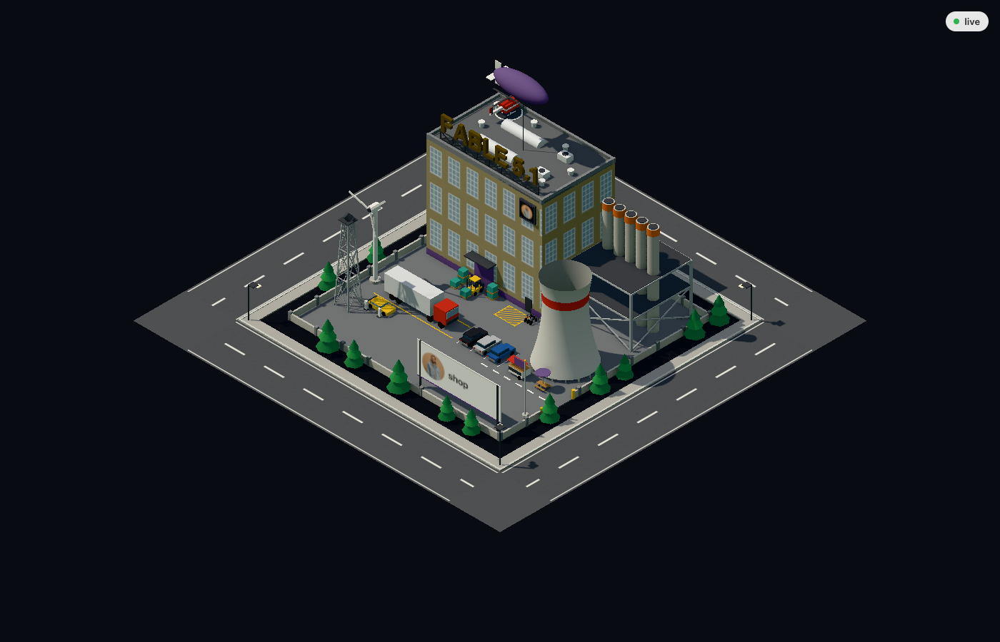

# Agent Factory

Shows every running Claude Code session on your machine as a factory in a 3D industrial park. A busy agent lights up its lot, and each tool type drives a different machine.


## Run it

```
pnpm install
pnpm dev
```

Then open http://localhost:5173. This starts the Node server on `127.0.0.1:4317` and the Vite page together. Vite proxies `/ws` to the server, and the page reconnects every 2 seconds while the server is down.

## Run it for a team

One Mac runs the hub:

```
pnpm hub
```

Every other Mac points at it:

```
HUB=ws://<hub-host>:4317 pnpm dev
```

Everyone opens their own http://localhost:5173 and sees one park with every machine's sessions. The hub prints the address to use when it starts. On a Mac it is the computer name plus `.local`, for example `ws://wahids-macbook.local:4317`.

Once the park has sessions from more than one machine, every sign and tooltip shows the machine name. The default is the host name up to the first dot. `MACHINE=wahid pnpm dev` picks a better one than `macbook-pro-3`.

The first time the hub starts, macOS asks once whether `node` may accept incoming connections. Click Allow. While the hub is down, a spoke's page shows `reconnecting...` and no lots, its own included. Both sides retry every 2 seconds.

## What you see

- one lot per session, with the session name on the sign
- the hall and machines are sized by the model the session runs (see below)
- sessions in the same folder share an accent color
- subagents show up as small warehouses inside the parent yard, up to 4 per lot
- the yard starts empty and fills with extras as your token total since the season start grows, see "Token milestones"
- hover a hall or warehouse for the name, status, current tool and model
- drag to rotate, scroll to zoom

| Model | Lot |
| --- | --- |
| Haiku | small hall, 1 stack, small cooling tower, short searchlight tower |
| Sonnet, or no model known yet | full hall with 1 row of windows, 3 stacks, cooling tower, lattice tower |
| Opus | 2 rows of windows, 4 taller stacks, bigger cooling tower, taller lattice tower |
| Fable or Mythos | 3 rows of windows, 5 tall stacks, biggest cooling tower, tallest lattice tower |

The model comes from the transcript, so a fresh session starts as a Sonnet sized lot and is rebuilt in place once its first response arrives. Switching models with `/model` rebuilds the lot the same way. Subagent warehouses have one size.

| Agent state | Animation |
| --- | --- |
| idle | dark windows, machines off, nothing from this lot on the roads |
| busy, no tool running | windows glow, thin smoke, slow steam, its truck drives the park roads plus one car per busy subagent |
| editing or writing files | forklift carries pallets between the dock and the truck bay |
| running a shell command | chimney rims glow orange and smoke is fast and thick |
| reading or searching files | searchlight sweeps the yard |
| any other tool | cooling tower steam is fast and thick |

## Token milestones

The yard starts empty: bay lines and no vehicles. It fills up as the token total of your machine grows, counted from the season start on 16 September 2026. Every row at or below your total is shown, on every lot of that machine.



| Tokens | Extra in the yard |
| --- | --- |
| 10M | bike rack with 3 bikes at the people door |
| 25M | 1st parked car |
| 50M | 2nd parked car |
| 100M | 3rd parked car, and a flagpole with a flag in the accent colour by the gate |
| 250M | coffee cart and a picnic table along the walkway |
| 500M | the truck at the dock bay |
| 750M | 2 EV chargers and a sports car in the front left corner |
| 1B | helipad with a helicopter on the hall roof |
| 2.5B | wind turbine at the front left fence, blades turning |
| 5B | blimp in the accent colour tethered above the hall |

What counts: the server sums the input, output, cache write and cache read tokens of every assistant message written on or after 16 September 2026 00:00 UTC in every transcript under `~/.claude/projects/`, subagents and finished sessions included, and counts each message once. Older messages add nothing, so every machine starts at 0 on the same day. The counting itself is the same as PokeTokenBar and ccusage, only from that date. Cache reads are most of it, which is why the ladder runs in the hundreds of millions to billions. A new season is one date change in `server/usage-ledger.ts`.

The total is 0 until the server has read every transcript once at start. That takes a few seconds per gigabyte of transcripts, and the yard fills as soon as it is done. Hover a hall to see the total. On a hub, every machine's total is visible to everyone on it.

## How it works

The server in `server/` watches `~/.claude/sessions/` and `~/.claude/projects/`. It reads each session file for the process id and status, and tails the transcript to find the running tool. On first sight it reads only the last 64 KB of a transcript, and only new bytes after that. Each change goes to the page over a WebSocket. At start it also reads every transcript once, in the background, to sum the season token total; from then on the same tail keeps that total live.

With `HUB` set, the server also opens one outbound connection to the hub and sends the same messages there. A hub lists what it receives next to its own sessions, prefixes each relayed session id with the machine name, and drops a machine's sessions when its connection closes. A spoke's page is proxied to the hub, so the spoke's own server only relays.

The page in `web/` draws the park with Three.js. Static parts of a lot are merged into one mesh, and repeated parts like trees and windows are instanced.

Only the tool name, a short label, the model id, the folder name, the machine name and the machine's season token total leave the server. The label is a file name, or the first 40 characters of a command or search pattern. The folder name is the last part of the working folder, never the full path. Prompts, responses and file contents stay on disk. The server never writes under `~/.claude/`.

Without `--hub` the server listens on localhost only. A hub listens on every network interface, so anyone on the same network can connect to it and read the same stream. Only run a hub on a network you trust.

Claude Code owns the format of these files, so an update can break the reader.

## Develop

```
pnpm test
pnpm typecheck
```

Specs and change proposals live in `openspec/`.
